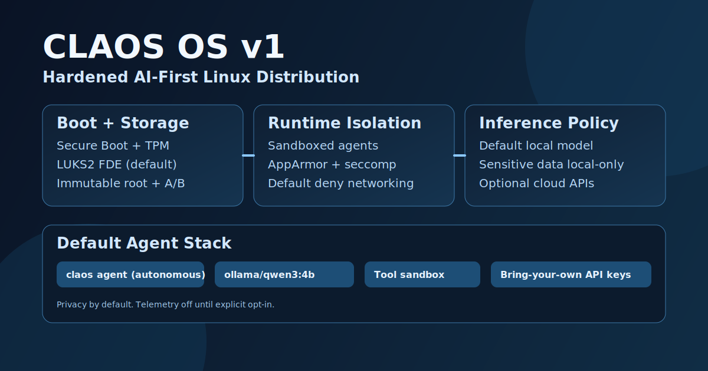

# CLAOS OS

<p align="center">
  
</p>

<p align="center">
  
</p>

**CLAOS OS** is a hardened, AI-first, local-first operating system experience for autonomous agents and local app creation.

## Simple Installation Guide (Non-Developers)

This path is for users who want to run CLAOS commands without building source code.

### 1) Install prerequisites

- Install Node.js 22+ from [https://nodejs.org](https://nodejs.org)
- Open Terminal

### 2) Run one setup command

```bash
bash scripts/os/quickstart-nondev.sh
```

This will:

- Install the CLI (`claos`)
- Enforce the strict security baseline
- Show your current security status

### 3) Create your first local app

```bash
claos os app create "My First App" --type simple
claos os app list
```

## Developer Installation Guide

This path is for contributors who want to build from source.

```bash
bash scripts/os/quickstart-dev.sh
```

This runs dependency install, build, and security baseline checks.

## Virtual Machine Install and Test

Use this if you want a safe environment before using real hardware.

### Create the VM (Beginner Path)

1. Install a VM app:
   - macOS: UTM, Parallels, or VMware Fusion
   - Windows/Linux: VirtualBox or VMware Workstation
2. Download Ubuntu 24.04 LTS Desktop ISO from [https://ubuntu.com/download/desktop](https://ubuntu.com/download/desktop).
3. Create a new Linux VM and attach the ISO.
4. Set resources:
   - CPU: 4 cores
   - RAM: 8 GB minimum (16 GB recommended)
   - Disk: 80 GB minimum
5. Boot VM and run Ubuntu installer (`Install Ubuntu`).
6. Reboot into Ubuntu after install, then open Terminal.

### Recommended VM settings

- OS: Ubuntu 24.04 LTS (x86_64)
- CPU: 4 cores
- RAM: 8 GB minimum (16 GB recommended)
- Disk: 80 GB minimum
- TPM/Secure Boot: enable when your hypervisor supports it

### In the VM

```bash
git clone https://github.com/openclaw/openclaw.git claos
cd claos
bash scripts/os/quickstart-nondev.sh
claos os security status
```

You should see strict security policy values and no critical failures.

## OS Image Status

Bootable ISO installer wiring is still in progress.

Current `scripts/os/build-iso.sh` validates build dependencies and prepares artifact paths, but does not yet produce a complete installable ISO image.

## Core Goals

- Security-first runtime defaults.
- Privacy-first model routing.
- Autonomous agent workflows on moderate hardware.
- Local app generation, install, and uninstall lifecycle.

## App Creation Modes

1. `simple`

- Uses a predefined app structure.
- LLM primarily generates metadata.
- Defaults to a local model profile.

2. `from-scratch`

- Generates applications from scratch.
- Requires modern high-capability cloud model credentials.
- Designed for advanced app synthesis tasks.

## Local App Lifecycle

Create, install, list, and uninstall local apps with CLAOS OS commands:

```bash
claos os app create "Daily Planner" --type simple
claos os app create "Code Builder" --type from-scratch
claos os app list
claos os app uninstall daily-planner --yes
claos os app uninstall daily-planner --yes --purge
claos os app install daily-planner
```

## Security Posture

- Strict policy profile by default.
- Sandboxed execution defaults for autonomous flows.
- Local-first model routing for sensitive classes.
- Telemetry disabled until explicit opt-in.

## CLAOS Command Surface

```bash
claos os attest
claos os security status
claos os security enforce
claos os rollback --yes
claos os recovery --yes
```

## Development

```bash
pnpm install
pnpm build
pnpm test
```

## License and Upstream Attribution

This project is a fork derived from **OpenClaw** and remains under the terms of the repository license in `LICENSE`.
Original license and copyright notices must be retained in redistributions.

Upstream source: [https://github.com/openclaw/openclaw](https://github.com/openclaw/openclaw)
